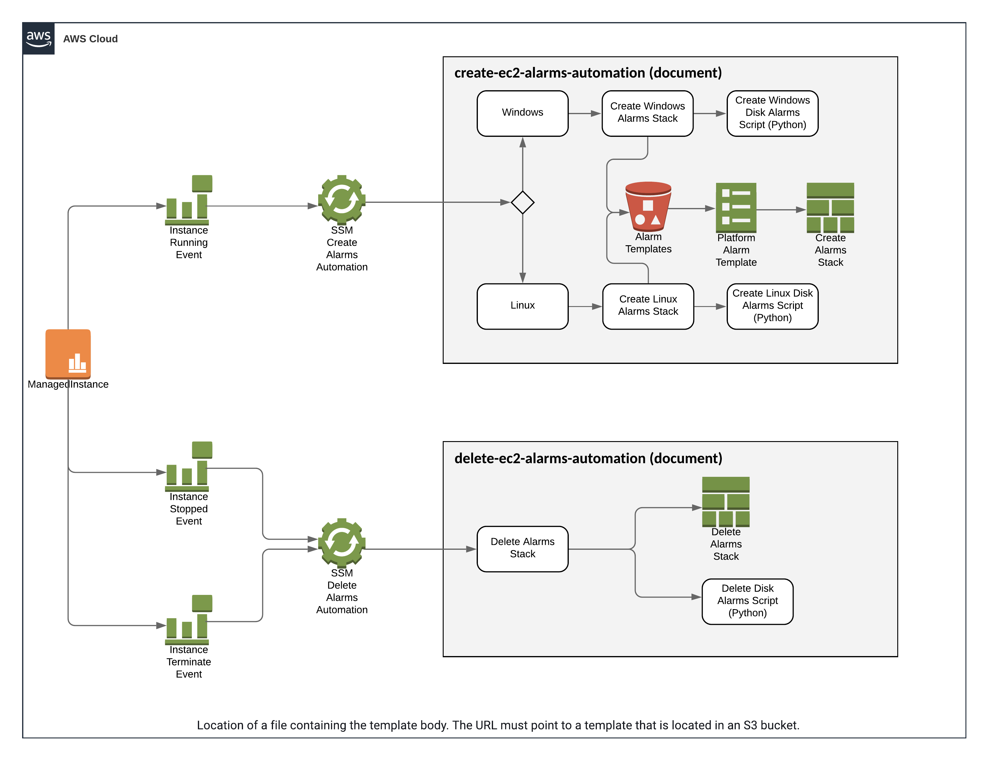

# alarm-automation

This is a DEMO of an alarm automation driven by CloudWatch Events, SSM Automations and CloudFormation Stacks.

## Prerequisites

- Install [Terraform](https://learn.hashicorp.com/terraform/getting-started/install.html)
- Install [Runway](https://docs.onica.com/projects/runway/en/release/installation.html)

- For custom metric alarms you will need to run the ssm automation `onboard-cloudwatch-agent` against your instances to install CWAgent and configure it with the provided custom metrics config file

## Deployment
   
Change the DEPLOY_ENVIRONMENT to AWS profile name for the account. i.e lab, dev, prod, test
   
```
DEPLOY_ENVIRONMENT=lab runway deploy
```

## Destruction

Change the DEPLOY_ENVIRONMENT to AWS profile name for the account. i.e lab, dev, prod, test

```
DEPLOY_ENVIRONMENT=lab runway destroy
```
## Built With

* Terraform >= 0.13.0
* Runway > 1.5.0

## Diagram

