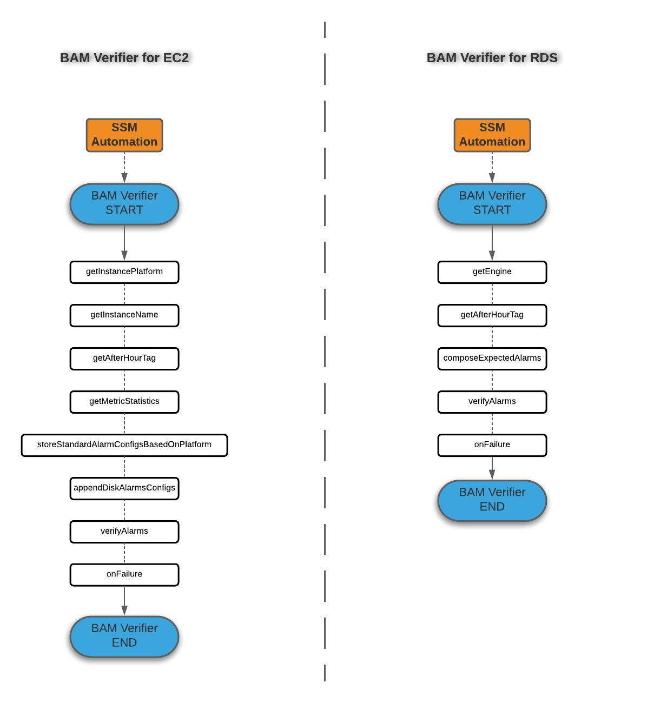

# documents

This is where our YAML files (with the extention of .tpl) are stored, we will not accept JSON files here.

# BAM Verifier template

The purpose of these automations is to verify the configs of each alarm created by BAM (currently verifies alarms for EC2 and RDS only).
 
In order to gather every relevant info for the alarm configs a *mockists* approach of TDD was exercised here.
Meaning, we try to mock the same steps that BAM takes to create the alarms. Some steps are combined into one. We just gather and package them in a way that allows for alarms verification in bulk.
 
#####The BAM Verifier automation steps currently look like this.
